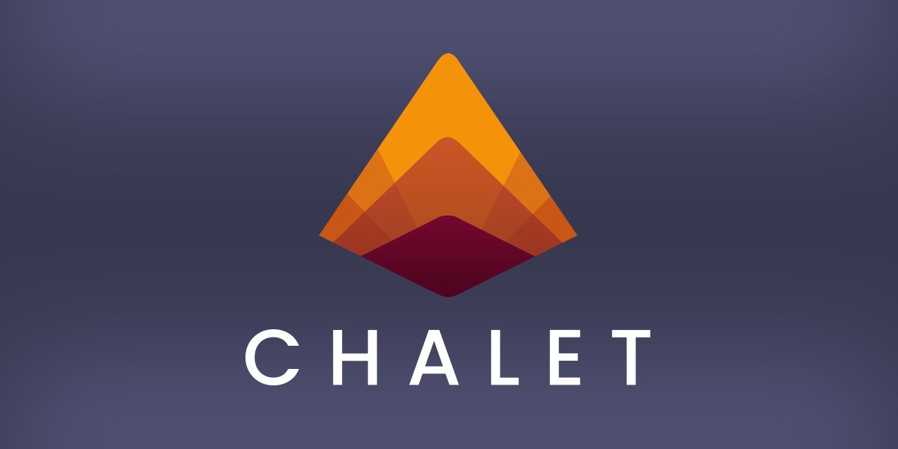

[](https://www.chalet-work.space)


<div align="center">
<p>A cross-platform project format & build tool for C/C++ focused on usability and interoperability.</p>

<hr />

[](https://github.com/chalet-org/chalet/releases)
[](https://github.com/chalet-org/chalet/blob/main/LICENSE.txt)
[](https://github.com/chalet-org/chalet/discussions)
[](https://github.com/orgs/chalet-org/repositories?q=chalet-example)

</div>

<br />

## Introduction

Chalet is a command-line application that reads from a JSON project file (chalet.json), and compiles your C/C++ projects. Behind the scenes, Chalet generates either a [Ninja](https://ninja-build.org/) or [Make](https://en.wikipedia.org/wiki/Make_(software)) build file and performs some caching. Chalet project files focus on intuitive language designed to be easy to understand, while at the same time providing lots of control. Because the projects are JSON, they can be easily integrated with IDEs.

Visit [https://www.chalet-work.space](https://www.chalet-work.space) to learn more about Chalet.

Visit [https://www.chalet-work.space/docs](https://www.chalet-work.space/docs) for the full documentation.

Explore some of the example repositories at: [https://github.com/orgs/chalet-org/repositories?q=chalet-example](https://github.com/orgs/chalet-org/repositories?q=chalet-example)

## Download

Grab the latest version from [https://www.chalet-work.space/download](https://www.chalet-work.space/download) or the [Releases](https://github.com/chalet-org/chalet/releases) section of this repository.

The actual release builds are still being fine-tuned, especially on Linux, so there may still be issues on various Linux distros.

## License

Chalet is released under the [BSD 3-Clause](https://opensource.org/licenses/BSD-3-Clause) license. See [LICENSE.txt](LICENSE.txt). 

## External Libraries that make Chalet possible

-   [JSON for Modern C++](https://github.com/nlohmann/json) - [MIT license](https://github.com/nlohmann/json/blob/develop/LICENSE.MIT)
-   [JSON schema validator for JSON for Modern C++](https://github.com/pboettch/json-schema-validator) - [MIT license](https://github.com/pboettch/json-schema-validator/blob/main/LICENSE)
-   [fmt](https://github.com/fmtlib/fmt) - [MIT license](https://github.com/fmtlib/fmt/blob/master/LICENSE.rst)
-   [stduuid](https://github.com/mariusbancila/stduuid) - [MIT license](https://github.com/mariusbancila/stduuid/blob/master/LICENSE)
-   [Catch2](https://github.com/catchorg/Catch2) - [BSL-1.0 license](https://github.com/catchorg/Catch2/blob/devel/LICENSE.txt)


## Build from Source

A C++17 compiler is required to build Chalet from source. Chalet is developed on various compiler versions, but the following versions are currently used during development:

MSVC `>= 19.30`  
Apple Clang `>= 13.x`  
GCC / MinGW `>= 11.x`

C++17 is targeted instead of C++20 for now to ensure a wide gamut of supported operating systems.

---
### Windows

**Install**: 

* [CMake](https://cmake.org/download) `>= 3.16`
* [Git for Windows](https://gitforwindows.org)


**Visual Studio**

1. Run `./fetch_externals.sh` from Git Bash. This will get external dependencies
2. Make sure CMake is accessible from Path (add to System Environment Variables)
3. Start "x64 Native Tools Command Prompt for VS 20XX"
4. Run `.\build_all.bat` from the project root

**MSYS2 with MinGW**

1. Get [MSYS2](https://www.msys2.org/)
2. Install the current stable GCC toolchain via:

```bash
pacman -S mingw-w64-x86_64-toolchain mingw-w64-x86_64-cmake mingw-w64-x86_64-ninja
```

3. Install `cmake` via pacman, otherwise install it from the link above and make sure it's accessible from Path (add to System Environment Variables)
4. Run `bash ./build_all.sh` from the project root

---
### MacOS

**Install**: 

* [CMake](https://cmake.org/download) `>= 3.16`

1. Install Xcode or Command Line Tools
2. Install CMake if it's not already
3. Run `bash ./build_all.sh` from the project root

---
### Linux

**Install**: 

A GCC version that supports C++17 is required. (`>= 7.3`)

1. Install `git` and `cmake` from your package manager
2. Run `bash ./build_all.sh` from the project root
